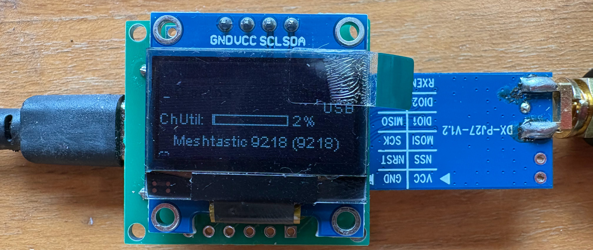
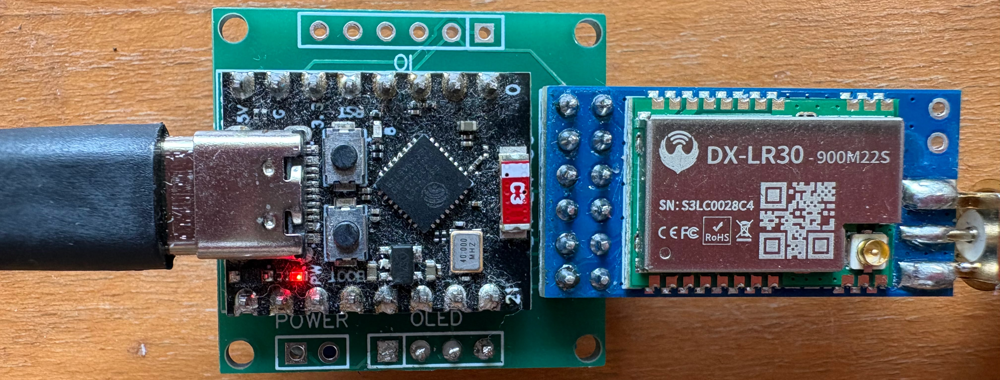

# Meshtastic-esp32-c3-dx-lr30
DIY Meshtastic node with ESP32-C3 supermini and DX-LR30 LoRa module

This repository contains the schematic, PCB layout, and Gerber files needed to manufacture a PCB on https://easyeda.com/.
It also includes the modifications required to use the Meshtastic firmware with this hardware design.

The firmware is an adaptation of the `helltec_esp32c3` board configuration, with custom pin changes to support the DX-LR30 module and the supermini board wiring.
The idea was to imitate the [Heltec HT-CT62](https://heltec.org/project/ht-ct62/) so this Meshtastic profile could be used.

## Sourcing the DX-LR30 module

This design targets the SX1262-based DX-LR30 LoRa module. A known AliExpress listing is:

- [https://nl.aliexpress.com/item/1005009833029680.html](https://nl.aliexpress.com/item/1005009833029680.html).

The MCU module is not required. There is the possibility to buy two modules, antennas and (not used) Dupont cables.

Important: Do not use the 433 MHz variants; they should work but Meshtastic runs on 868 Mhz (at least in the European Union).

The ESP32-C3 supermini board used in this project can also be sourced from AliExpress:

- [https://nl.aliexpress.com/item/1005006056663228.html](https://nl.aliexpress.com/item/1005006056663228.html)

The OLED module is a standard I2C Oled module and can also be sources from AliExpress:

- [https://nl.aliexpress.com/item/1005007551771400.html](https://nl.aliexpress.com/item/1005007551771400.html)

## What is included

- `schematic/` - project schematic files for the ESP32-C3 supermini and DX-LR30 module.
- `pcb/` - PCB layout files and board design exported from EasyEDA.
- Gerber files for PCB fabrication.
- Modified Meshtastic firmware support for the Heltec ESP32-C3 variant with updated pin assignments.

## ESP32-C3 to DX-LR30 pin mapping

This board uses the Heltec ESP32-C3 `pins_arduino.h` and `variant.h` definitions. The SX1262-based DX-LR30 wiring is mapped as follows:

| Arduino pin name | ESP32-C3 GPIO | DX-LR30 signal | Function |
|---|---|---|---|
| `SS` | `GPIO8` | `NSS` / `CS` | SPI chip select |
| `SCK` | `GPIO9` | `SCK` | SPI clock |
| `MOSI` | `GPIO7` | `MOSI` | SPI MOSI |
| `MISO` | `GPIO6` | `MISO` | SPI MISO |
| `GPIO5` | `GPIO5` | `RESET` | Module reset |
| `GPIO3` | `GPIO3` | `DIO1` | LoRa interrupt / status |
| `GPIO4` | `GPIO4` | `BUSY` | LoRa busy |
| `3V3` | — | `VCC` | Power supply |
| `GND` | — | `GND` | Ground |

- `DIO0` and `DIO2` are not connected in this variant (`RADIOLIB_NC`).

> Note: Pin names and numbering reflect the Heltec ESP32-C3 board variant. Use this table as the reference for the custom Meshtastic firmware adaptation and PCB wiring in this project.

## ESP32-C3 to OLED pin mapping

The OLED display is connected using the Heltec board's I2C definitions from `pins_arduino.h` and `variant.h`.

| Arduino pin name | ESP32-C3 GPIO | OLED signal | Function |
|---|---|---|---|
| `SDA` | `GPIO20` | `SDA` | I2C data |
| `SCL` | `GPIO21` | `SCL` | I2C clock |
| `3V3` | — | `VCC` | Power supply |
| `GND` | — | `GND` | Ground |

> Note: This project uses a standard I2C SSD1306 OLED module. The OLED reset pin is not explicitly mapped in this variant.

## Building

- Use platformIO to build the esp32 firmware (I did not use the development container)
- Before compiling, replace the files in the Heltec esp32c3 directory with the files provided in the meshtastic directory; these will change the target and the pin mapping.
- Upload to the ESP32-C3 
- Use the Meshtastic app (from the Apple store to connect)

## Final result

The result is a compact Mestastic device

## Improvements

- The implementation is not equal to the Heltec HT-CT62. I unfortunately made a mistake and swapped MOSI and SCK and this should be solved.
- Using an esp32-c3 supermini the GPIO8 is also connected to the blue LED. This is not a problem but uses more energy.
- The red LED cannot be turned off so this is also consuming energy.
- Using an ESP32-S3 with PSRAM is a better choice as also messages can be stored and forwarded.
- The I2C bus is now mapped to SDA/SCL on GPIO20/GPIO21. The original mapping for the esp32 was SDA/SCL on GPIO01/GPIO00
- Unused pins can be used for a buzzer or additional IO on the PCB